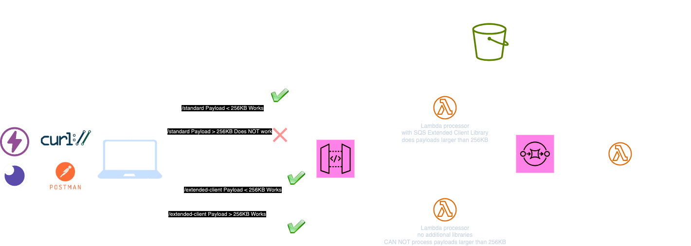

# SQS Extended Client Node.js Example


<small><em>Logos in the screenshot belongs to their trademark owners</em></small>

## Overview

This project demonstrates the use of AWS SQS with extended client capabilities to handle large payloads. It leverages AWS services such as SQS, Lambda, and API Gateway, and is built using the <a href="https://sst.dev" target="_blank">SST v3</a> (Serverless Stack Toolkit).  
This is the <a href="https://www.npmjs.com/package/sqs-extended-client" target="_blank">Node.js implementation</a>. 
#### AWS has officially released this client only for Java and Python. This is the unofficial Node.js implementation.


## Features

- **Standard SQS Client**: A Lambda function that sends messages to an SQS queue using the standard AWS SDK.
- **Extended SQS Client**: A Lambda function that uses the SQS Extended Client to send large payloads, storing them in an S3 bucket.
- **API Gateway Integration**: Provides RESTful endpoints to interact with the SQS queues.

## Architecture

- **SQS Queue**: A message queue for handling standard and large messages.
- **S3 Bucket**: Used by the extended client to store large message payloads.
- **API Gateway**: Exposes endpoints for sending messages to the SQS queue.
- **AWS Lambda Powertools**: We use the Logger function to create debug logs in CW Logs.

## Setup

1. **Prerequisites**:

   - **AWS Credentials**: Ensure you have AWS credentials set up on your machine.
   - **Node.js**: Make sure Node.js is installed on your system.

2. **Clone the Repository**:

   - Clone the repository:
     ```bash
     git clone https://github.com/AlperSakarya/sqs-extended-client-example
     ```
   - Navigate into the project directory:
     ```bash
     cd sqs-extended-client-example
     ```

3. **Install Dependencies**:

   - Install the necessary packages by running:
     ```bash
     npm install
     ```

4. **Deploy the Stack**:

   - Use SST to deploy the stack to your AWS account:
     ```bash
     npx sst deploy --stage dev
     ```
     <em>when you are cleaning up change "deploy" to "remove"</em>

5. **Invoke the API and Test**:

   - Use the API endpoints displayed in the deployment output to send messages to the SQS queue.
   - Create a large payload
     ```bash
     # This creates 396KB of random characters
     head -c 300000 /dev/urandom | base64 > large-payload.json
     ```
   - You can use `curl` to interact with the API endpoints:
     ```bash
     # Smaller messages than 256KB works for both endpoints

     curl -X POST <API_ENDPOINT>/standard -d '{"message": "small payload"}' -H "Content-Type: application/json"

     curl -X POST <API_ENDPOINT>/extended-client -d '{"message": "small payload"}' -H "Content-Type: application/json"
     ```
     ```bash
     # Messages larger than 256KB only wiorks for /extended-client
     # Do not forget to create the large-paylogad.json in the steps above.
     
     curl -X POST <API_ENDPOINT>/extended-client d @large-payload.json -H "Content-Type: application/json"

     # E.g curl -X POST https://459asc5vwk.execute-api.us-east-1.amazonaws.com/extended-client -d @large-payload.json -H "Content-Type: application/json"
     ```

   - **Note**:
     - The `/standard` endpoint **does not work** for messages larger than 256KB.
     - The `/extended-client` endpoint **works** for messages larger than 256KB.


## Code Structure

- **`sst.config.ts`**: Configures the SST app, setting up the SQS queue, S3 bucket, and API Gateway.

- **`lambda-functions/standard-lambda/index.js`**: Handles sending messages using the standard SQS client.

- **`lambda-functions/extended-client-lambda/index.js`**: Handles sending large messages using the SQS Extended Client.


## Dependencies

- **@aws-sdk/client-sqs**: AWS SDK for JavaScript SQS client.
- **sqs-extended-client**: A client for handling large SQS messages.
- **@aws-lambda-powertools/logger**: A logger for AWS Lambda functions.

## License

This project is licensed under the MIT License.

